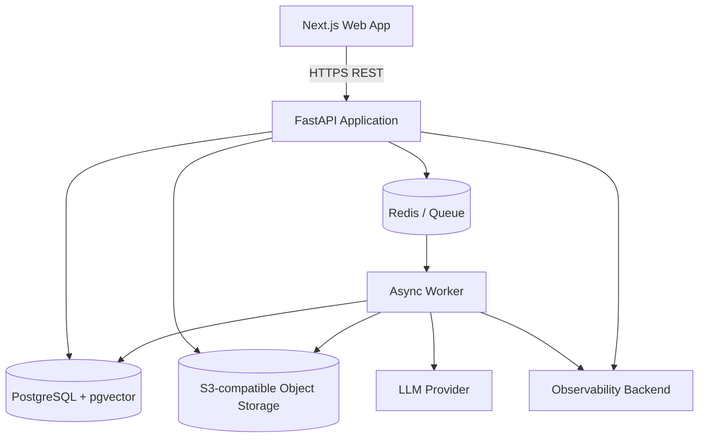

# 06 — System Architecture

## Architecture strategy

ClaimAssist starts as a **modular monolith + asynchronous workers**, not a microservice mesh.

Why:
- the domain is still evolving;
- one transactional database simplifies correctness and auditability;
- module boundaries can be enforced in code;
- workers provide independent scaling for expensive document/AI workloads;
- future service extraction remains possible after load/ownership evidence exists.

## C4 — Context view

```mermaid
flowchart LR
    CP[Claims Processor]
    CR[Claims Reviewer]
    SU[Supervisor]
    AD[Administrator]
    AU[Auditor]

    APP[ClaimAssist AI Platform]
    LLM[LLM Provider]
    OBJ[S3-Compatible Object Storage]
    OBS[Logs / Traces / Metrics]

    CP --> APP
    CR --> APP
    SU --> APP
    AD --> APP
    AU --> APP
    APP --> LLM
    APP --> OBJ
    APP --> OBS
```



## C4 — Container view



## FastAPI module boundaries

```text
app/
  api/
  core/
  auth/
  claims/
  members/
  policies/
  documents/
  reviews/
  audit/
  agents/
  tools/
  rag/
  rules/
  risk/
  jobs/
  observability/
  integrations/
```

Rules:
- API routers contain transport concerns only.
- Domain/application services own workflows and transactions.
- Repositories own persistence access.
- Agents call approved tools, not repositories directly.
- Tools call application services with an explicit actor/context.
- Cross-module writes occur through public service interfaces.

## Primary data stores

### PostgreSQL
System-of-record for:
- identities and RBAC;
- members/providers/policies/versions;
- claims and lines;
- extracted facts;
- deterministic check results;
- reviews/recommendations;
- agent/tool telemetry;
- audit events.

### pgvector
Used inside PostgreSQL for policy chunks/embeddings so vector evidence retains relational policy-version metadata.

### Redis
Used for:
- task queue/broker;
- short-lived dedup/idempotency support where appropriate;
- rate-limit counters;
- ephemeral job progress/cache when safe.

Redis is not a source of truth.

### Object storage
Stores claim/policy document binaries.
Database stores metadata, object key, checksum, content type, size and provenance.

## Synchronous path

Use synchronous request/response for:
- authentication;
- claim CRUD;
- list/filter views;
- review submission;
- audit/evidence reads;
- creating an async analysis job.

## Asynchronous path

Use worker jobs for:
- file parsing;
- extraction;
- malware-scan integration hook;
- policy chunking/embedding;
- RAG indexing;
- multi-agent analysis;
- re-analysis;
- expensive evaluation batches.

## Trust boundaries

1. Browser <-> API: untrusted client input.
2. Uploaded document <-> parser/LLM: untrusted document content.
3. LLM <-> tools: probabilistic caller crossing into deterministic capabilities.
4. App <-> object storage/database: privileged infrastructure boundary.
5. External model provider: controlled data egress boundary.

## Architectural invariants

- No LLM directly writes final claim status.
- No tool is authorized by prompt text.
- No cross-policy-version RAG evidence unless explicitly requested.
- No real secrets in code/repo.
- No final human action without audit event.
- No hidden retry loop without bounded attempts and telemetry.
