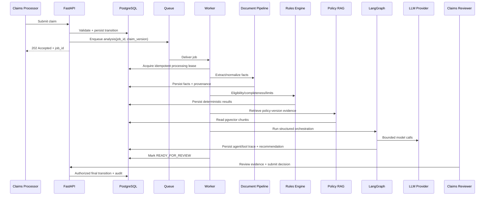

# 07 — System Design Deep Dive

## 1. End-to-end claim analysis sequence

## 2. Consistency model

Strong consistency is required for:
- claim version/state;
- reviewer decision;
- audit event associated with a state mutation;
- policy version association;
- idempotent job creation.

Eventual consistency is acceptable for:
- derived dashboard counters;
- async extraction status;
- embeddings/index refresh;
- telemetry aggregation.

## 3. Claim versioning

Each material claim/document change increments `claim_version`.

An analysis run stores:
- `claim_id`;
- `claim_version`;
- `policy_version_id`;
- document-set fingerprint;
- rules version;
- prompt version;
- model/provider metadata.

Reviewer UI must show if the recommendation was produced for an older claim version.

## 4. Idempotency

### API
For retriable create/process operations:
- client sends `Idempotency-Key`;
- server stores key + actor + operation + normalized request hash + result reference;
- same key + same request returns original result;
- same key + different request fails with conflict.

### Worker
Unique processing key:
`analysis:{claim_id}:{claim_version}:{analysis_profile_version}`

Only one active run for the same key.

## 5. Concurrency control

Use:
- database transactions;
- unique constraints;
- optimistic row version for claim/review updates;
- `SELECT ... FOR UPDATE` only for narrow critical sections;
- deduplication keys for workers.

Avoid holding DB transactions while waiting for LLM/network calls.

## 6. Failure design

| Failure | Behavior |
|---|---|
| Parser failure | Mark document extraction failed; retain original file; expose reason |
| LLM timeout | Retry bounded times; then MANUAL_REVIEW-safe path |
| Tool timeout | Record failed tool call; do not invent result |
| DB transient failure | Transaction rollback + bounded retry where safe |
| Object storage unavailable | Fail upload/process explicitly; no DB metadata claiming success |
| Wrong/insufficient RAG evidence | Return insufficient evidence |
| Worker crash | Job becomes retryable after lease timeout |
| Duplicate message delivery | Idempotent handler returns existing result |
| Stale reviewer submit | 409 conflict with latest version metadata |

## 7. Backpressure

- API queues expensive work instead of executing inline.
- Workers have configured concurrency.
- Queue depth and oldest-job age are monitored.
- Large files have strict size limits.
- Model calls have per-run and global concurrency limits.
- New analysis can be rejected/throttled safely when capacity is exceeded.

## 8. Caching

Safe candidates:
- stable policy metadata;
- read-only reference data;
- selected retrieval results keyed by policy version + query hash if validated.

Do not cache:
- authorization decisions across changed roles without invalidation;
- final review actions;
- claim detail responses containing stale version-sensitive data for long periods.

## 9. Audit transaction pattern

For important mutations:
1. authorize actor;
2. load current row/version;
3. validate business transition;
4. write mutation;
5. write audit event in same DB transaction;
6. commit;
7. emit non-critical telemetry after commit.

## 10. Event/outbox option

If reliable downstream events become necessary, use a transactional outbox table.
Do not introduce Kafka purely for portfolio complexity.

## 11. Scaling path

Stage 1:
- one API container;
- one worker;
- PostgreSQL/pgvector;
- Redis;
- object storage.

Stage 2:
- multiple stateless API replicas;
- multiple workers by queue;
- managed PostgreSQL;
- managed Redis;
- autoscaling based on CPU/queue depth.

Stage 3 only if justified:
- separate document-processing workers;
- separate ingestion/evaluation workers;
- read replicas/partitioning after measured bottlenecks.

## 12. Capacity model for demo

Track:
- claims/hour;
- documents/claim;
- average document MB;
- extraction seconds/document;
- LLM calls/analysis;
- tokens/analysis;
- vector chunks/policy;
- queue wait time;
- DB query p95.

The architecture should be tuned from measurements, not assumed scale.
