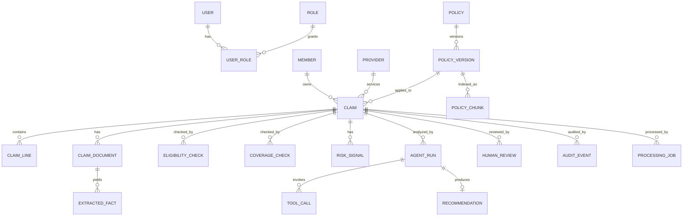

# 08 — Data Model and ERD

## Core entities

- User
- Role
- UserRole
- Member
- Provider
- Policy
- PolicyVersion
- Claim
- ClaimLine
- ClaimDocument
- ExtractedFact
- PolicyChunk
- EligibilityCheck
- CoverageCheck
- RiskSignal
- AgentRun
- ToolCall
- Recommendation
- HumanReview
- AuditEvent
- ProcessingJob
- IdempotencyRecord

## ERD

## Key field requirements

### claims
- `id UUID PK`
- `claim_number unique`
- `member_id FK`
- `provider_id FK`
- `policy_version_id FK`
- `status enum`
- `service_start_date`
- `service_end_date`
- `claimed_amount numeric(14,2)`
- `currency char(3)`
- `claim_version integer`
- `created_by`
- timestamps
- optimistic lock/version field

Indexes:
- `(status, created_at)`
- `(member_id, service_start_date)`
- `(provider_id, service_start_date)`
- `(policy_version_id)`

### claim_documents
- `id UUID PK`
- `claim_id FK`
- `document_type`
- `object_key`
- `sha256`
- `content_type`
- `size_bytes`
- `processing_status`
- `uploaded_by`
- timestamps

Unique/dedup option:
- `(claim_id, sha256)`

### extracted_facts
- `id UUID PK`
- `claim_document_id FK`
- `fact_type`
- `value_json`
- `normalized_value`
- `source_page`
- `source_span`
- `extractor_version`
- `confidence`
- timestamps

### policy_versions
- `id UUID PK`
- `policy_id FK`
- `version_code`
- `effective_from`
- `effective_to`
- `document_sha256`
- `index_status enum PENDING|INDEXING|READY|FAILED NOT NULL DEFAULT PENDING`
- timestamps

Constraint: effective ranges must be valid; retrieval always scopes by `policy_version_id`.

Index status records readiness: `PENDING` means indexing has not started;
`INDEXING` means ingestion/embedding/index validation is in progress;
`READY` means indexing was successfully validated and is usable for retrieval;
`FAILED` means indexing failed and requires retry/investigation.
No other index states are allowed. The core domain schema only persists the status;
it does not implement indexing or retrieval.

### policy_chunks
- `id UUID PK`
- `policy_version_id FK`
- `section`
- `clause_id`
- `page`
- `chunk_text`
- `embedding vector(...)`
- `chunk_hash`
- metadata JSONB

### agent_runs
- `id UUID PK`
- `claim_id FK`
- `claim_version`
- `policy_version_id`
- `correlation_id`
- `status`
- `graph_version`
- `prompt_version`
- `model_provider`
- `model_name`
- token/cost metadata
- started/finished timestamps

### tool_calls
- `id UUID PK`
- `agent_run_id FK`
- `tool_name`
- `tool_version`
- `input_hash`
- sanitized input/output JSON
- `status`
- `error_code`
- latency
- timestamps

### recommendations
- `id UUID PK`
- `agent_run_id unique FK`
- `category`
- reasons JSON
- citations JSON
- missing_documents JSON
- risk_summary JSON
- `requires_human_review = true`

### human_reviews
- `id UUID PK`
- `claim_id FK`
- `recommendation_id FK nullable`
- `reviewer_id FK`
- `decision`
- `override_reason_code nullable`
- `comments`
- `claim_version`
- timestamp

### audit_events
Append-only:
- actor type/id
- event type
- entity type/id
- correlation id
- before/after hashes or safe snapshots
- source IP/user-agent where appropriate
- timestamp

## Data rules

- Monetary values use Decimal/numeric, never float.
- Times are stored UTC; business dates remain date types.
- UUIDs for externally exposed primary identifiers.
- Sensitive fields are redacted from logs.
- Binary documents never stored directly in PostgreSQL.
