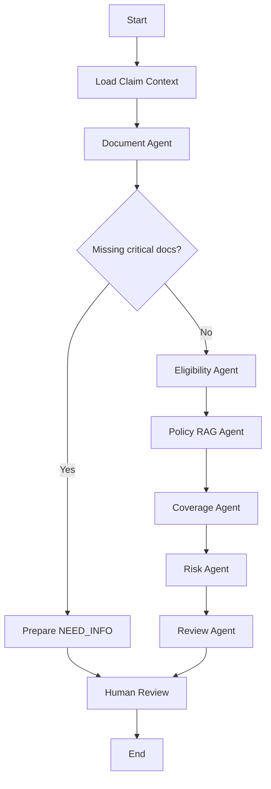

# 10 — Agentic AI System Design

## Design rule

Agents perform bounded reasoning over explicit state and approved tools.
They are not autonomous administrators of the platform.

## Agents

| Agent | Responsibility | May not do |
|---|---|---|
| Supervisor | Route workflow, detect missing prerequisites, consolidate state | Finalize claim decision |
| Document Agent | Interpret normalized extracted facts, missing items, conflicts | Modify source documents |
| Eligibility Agent | Invoke deterministic eligibility tools and explain results | Invent eligibility |
| Policy RAG Agent | Retrieve correct policy-version clauses | Search across arbitrary versions |
| Coverage Agent | Combine deterministic rules + retrieved clauses | Override failed rules |
| Risk Agent | Summarize explainable risk/anomaly indicators | Accuse fraud as fact |
| Review Agent | Build structured reviewer package | Mutate final status |

## Canonical state

```text
ClaimAgentState
  claim_id
  claim_version
  correlation_id
  member_context
  provider_context
  policy_context
  document_inventory
  extracted_facts
  missing_documents
  eligibility_results
  retrieved_policy_evidence
  coverage_results
  risk_signals
  tool_errors
  recommendation
  confidence_metadata
  requires_human_review = true
```

## LangGraph flow



## Structured recommendation

```json
{
  "recommendation": "NEED_INFO",
  "reasons": [],
  "missing_documents": [],
  "eligibility": {},
  "coverage_findings": [],
  "risk_signals": [],
  "citations": [],
  "confidence_metadata": {},
  "requires_human_review": true
}
```

## Model-call rules

- Temperature/creativity kept low for extraction/review synthesis.
- Structured output/schema validation required.
- Prompt version recorded.
- Bounded retries only for transport/schema-repair cases.
- No hidden chain-of-thought persistence is required; store concise structured reasons/evidence.
- Unsupported evidence produces `UNKNOWN` / `MANUAL_REVIEW`.
- Every citation must resolve to a retrieved chunk/tool result.

## Agent failure handling

- Node failure is captured in state.
- Critical tool failure prevents unsupported downstream conclusion.
- Supervisor can route to manual review.
- Re-running uses claim/version fingerprint to avoid stale results.
